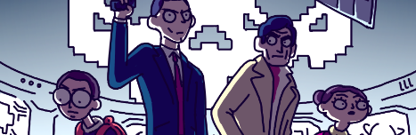

# Undercover Network

### <u>MISSION</u>

***La salle des serveurs est le quartier général du département recherche et développement.*** 
***Le scientifique y élabore ses gadgets les plus farfelus destinés aux agents de terrain.***

### OBJECTIF DE LA MISSION : LOCALISER LE HACKER

Vous venez de pénétrer dans la salle de commandement. 

Vous devez réussir à vous connecter sur l'ordinateur du réseau Undercover. Mais comment trouver le mot de passe?

Il semblerait que la sécurité informatique du réseau n'ait pas toujours été optimum chez Undercover et la procédure d' "unboarding" automatisée du scientifique n'a pas toujours été optimum.

Il faudrait vous faire passer pour un nouvel agent, et effectuer la procèdure d' Unboarding réservée aux nouveaux embauchés.
